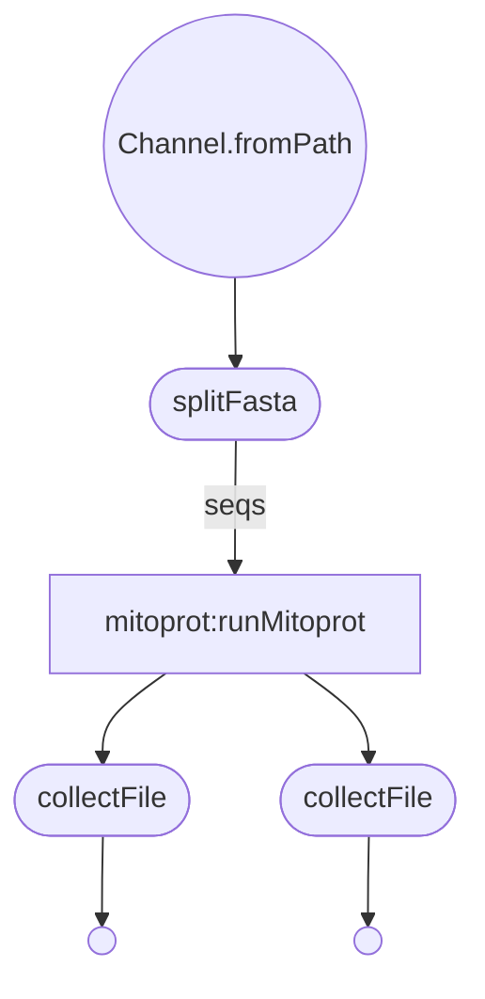

THIS REPO IS 🚧 UNDER CONSTRUCTION 🚧 and NOT Used in ANY production CODE

# Nextflow Conversion of repeatMaskerTask.pm

***
Mitoprot
***  

### Get Started
  * Install Nextflow
    
    `curl https://get.nextflow.io | bash`
  
  * Run the script
    
    `nextflow run VEuPathDB/Mitoprot -with-trace -c  <config_file> -r main`

### Description of nextflow configuration parameters:

| param         | value type        | description  |
| ------------- | ------------- | ------------ |
| inputFilePath | string| Path to the input fasta file. |
| outputDir | string | Where you would the the output file to be stored. |
| outputFileName | string | Desired output file name. |
| formatType | string | InputFileType <a,p,s>. Use "a" for fasta inputs. |
| fastaSubsetSize | int | Number of sequences per run of tool. |
